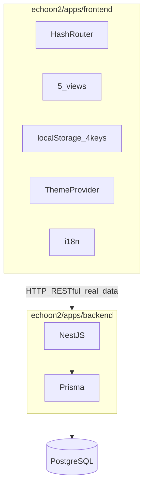

# echoon2 按文档实施计划

## 现状

- [echoon2/docs](file:///Users/lourd/Desktop/example/echoon2/docs) 已覆盖：需求、布局、MVP 前端、后端与数据库、以及 echoon 技术架构参考。
- [echoon2](file:///Users/lourd/Desktop/example/echoon2) **尚无**根级 `package.json` / `apps/*`，需新建工程（可参考 [lingoPath/apps/frontend](file:///Users/lourd/Desktop/example/lingoPath/apps/frontend) 与 [echoon](file:///Users/lourd/Desktop/example/echoon) 的 pnpm 结构，但以 `docs` 为准）。
- [.agents/skills](file:///Users/lourd/Desktop/example/echoon2/.agents/skills) 在实现时作为规范来源：**前端**读 [shadcn/SKILL.md](file:///Users/lourd/Desktop/example/echoon2/.agents/skills/shadcn/SKILL.md) 及子规则；**数据库**读 [prisma-database-setup/SKILL.md](file:///Users/lourd/Desktop/example/echoon2/.agents/skills/prisma-database-setup/SKILL.md)；**后端**读 [nestjs-best-practices/SKILL.md](file:///Users/lourd/Desktop/example/echoon2/.agents/skills/nestjs-best-practices/SKILL.md) 与 [AGENTS.md](file:///Users/lourd/Desktop/example/echoon2/.agents/skills/nestjs-best-practices/AGENTS.md)；**容器**可对照 [multi-stage-dockerfile/SKILL.md](file:///Users/lourd/Desktop/example/echoon2/.agents/skills/multi-stage-dockerfile/SKILL.md)。

## 规范对齐（必须）

| 来源 | 文件 | 约束 |
|------|------|------|
| 功能 | [导游口试训练-需求文档.md](file:///Users/lourd/Desktop/example/echoon2/docs/导游口试训练-需求文档.md) | hash 五路由、首次绑定、四键本地存储、练习快捷键与语音规则、各页能力 |
| 布局 | [导游口试训练-页面布局文档.md](file:///Users/lourd/Desktop/example/echoon2/docs/导游口试训练-页面布局文档.md) | 全局骨架、各页区块顺序与双列/三列结构不改 |
| 前端实现 | [echoon2-MVP前端实现方案（shadcn+base-ui+主题化+国际化）.md](file:///Users/lourd/Desktop/example/echoon2/docs/echoon2-MVP前端实现方案（shadcn+base-ui+主题化+国际化）.md) | 技术栈、主题、i18n、与需求/布局双约束 |
| 后端与库 | [导游口试训练-后端与数据库实现文档.md](file:///Users/lourd/Desktop/example/echoon2/docs/导游口试训练-后端与数据库实现文档.md) | 域模型、API 形态、MVP 边界与验收 |

## 目标架构（实施后）

## 阶段 0：Monorepo 与共享约定

- 在 `echoon2` 根目录增加：`package.json`（`pnpm` workspaces）、`pnpm-workspace.yaml`、根 `.gitignore`、`.nvmrc` 或 `engines`（与 [lingoPath](file:///Users/lourd/Desktop/example/lingoPath/apps/frontend/package.json) 对齐 Node 22+）。
- 工作区包：`apps/frontend`、`apps/backend`（名称与 filter 在各自 `package.json` 中固定，便于 `pnpm --filter`）。
- 可选：根 `README.md` 指向 `docs` 中「如何本地跑」三步（install / migrate / dev）。

## 阶段 1：后端与数据库先行（真实数据优先）

**以** [导游口试训练-后端与数据库实现文档.md](file:///Users/lourd/Desktop/example/echoon2/docs/导游口试训练-后端与数据库实现文档.md) **为契约**，先把数据与 API 打通，再做前端页面。

1. 在 `apps/backend` 创建 Nest 应用（按域拆模块：`config`、`question-bank`、`practice`、`assets`、`mock-exam`、`profile`、`membership`、`dictionary`）。
2. 在 `prisma/schema.prisma` 建模与索引：题库、题目、绑定配置、收藏、生词、练习记录、模考记录、偏好、会员。
3. 建立 RESTful 资源规范：名词化路径、HTTP 动词语义、统一分页/排序/筛选查询参数（`page/limit/sort/order/keyword`）。
4. 建立统一分页设计（后端基础能力）：
   - `PaginationQueryDto`：`page/limit/sort/order/keyword/filters`
   - `PaginationResult<T>`：`items/page/limit/total/totalPages/hasNext/hasPrev`
   - 通用 Prisma 分页 helper：统一 `skip/take/orderBy/where` 组装
   - 首批覆盖：题库列表、其他题型列表、模考成绩、练习记录、收藏、生词
5. 建立统一响应与错误规范：`requestId`、业务错误码、`400/401/403/404/409/422` 使用边界。
6. 实现 seed（真实可用样本数据），并提供最小健康检查与启动脚本。
7. API 第一批必须覆盖：首页、练习、收藏、生词、配置绑定、模考成绩、个人概览。

验收：后端接口可直接被前端消费，无 mock 依赖；需求 4.x 对应接口可跑通。

## 阶段 2：前端实现（直接接真实 API）

**以前端 MVP 文档为工程基线**，但数据层直接对接阶段 1 的 RESTful API。

1. **脚手架**：Vite + React + TS，安装与 [MVP 文档](file:///Users/lourd/Desktop/example/echoon2/docs/echoon2-MVP前端实现方案（shadcn+base-ui+主题化+国际化）.md) 第 2 节一致依赖。
2. **shadcn**：按 [lingoPath/components.json](file:///Users/lourd/Desktop/example/lingoPath/apps/frontend/components.json) 初始化，严格遵循 [shadcn SKILL](file:///Users/lourd/Desktop/example/echoon2/.agents/skills/shadcn/SKILL.md)。
3. **路由与布局**：HashRouter + 布局文档强约束（不删减模块/顺序）。
4. **页面与行为**：题库首页、练习页、模考页、个人中心、会员页按需求实现。
5. **数据接入**：`lib/request.ts` 直连 `/api/v1/guide-exam`，按资源 API 拆 `features/*/api.ts`。
6. **本地键迁移**：四键继续保留（离线体验），并与后端数据同步。

## 阶段 2.1：前端配置化二次封装（DataTable + Form）

目标：把可复用的“列表+表单”能力抽到组件层，实现配置驱动，减少业务页重复代码。

0. **技术栈固定（本阶段强约束）**
   - 表单：`react-hook-form` + `zod`
   - 表格：`@tanstack/react-table`
   - UI：与 `shadcn` 组件组合（Table/Input/Button/Pagination 等）

1. **DataTable 二次封装**
   - 组件：`ConfigDataTable`
   - 入参配置：
     - `columns`（列定义：标题、字段、render、排序、宽度）
     - `querySchema`（筛选项定义：输入框/选择器/日期等）
     - `actions`（行内操作与批量操作）
     - `pagination`（页码、每页条数、总数）
   - 输出事件：
     - `onQueryChange`
     - `onPageChange`
     - `onSortChange`
     - `onAction`
   - 要求：与 RESTful 分页/筛选参数规范对齐（`page/limit/sort/order/keyword`）。

2. **Form 二次封装**
   - 组件：`ConfigForm`
   - 入参配置：
     - `fields`（字段定义：type/name/label/placeholder/default/options/visibleWhen）
     - `layout`（单列/双列/分组/Section）
     - `schema`（zod 校验）
     - `submit`（提交按钮与行为）
   - 能力要求：
     - 统一错误显示
     - 联动字段（如绑定题库四级联动）
     - 可复用于设置页、绑定弹窗、筛选栏
     - 支持 `mode=create|edit|view`，统一新增/编辑场景

2.1 **新增/修改交互约束（强制）**
   - 所有“新增”和“修改”操作，统一使用 `Dialog + ConfigForm`
   - 页面内不使用独立整页编辑表单（MVP 阶段禁止）
   - 提交流程统一：
     - 打开 Dialog（带初始值）
     - 表单校验（RHF + zod）
     - 提交 RESTful API（create/update）
     - 成功后关闭 Dialog + 刷新列表 + toast
     - 失败保留表单状态并显示错误

3. **落地范围（MVP）**
   - 至少在以下页面落地一次：
     - 题库绑定弹窗（Form 配置化）
     - 模考最近成绩/其他题型列表（DataTable 配置化）
     - 个人中心设置项（Form 配置化）
     - 任一资源的新增/修改（必须为 Dialog + ConfigForm）

4. **工程约束**
   - 二次封装优先组合 shadcn/base-ui 现有组件，不重新造低层控件
   - 样式遵循 `shadcn` 规则（语义 token、`cn()`、无硬编码颜色）
   - 配置类型必须 TS 强类型，避免 `any` 配置
   - Form 统一封装 RHF 的 `FormProvider` 与字段注册，页面层不直接散用 `register`
   - Table 统一封装 TanStack 状态（sorting/filtering/pagination），页面层只传配置与数据源回调

## 阶段 3：联调与数据迁移

1. 定义 OpenAPI（或最小接口文档）并对齐前后端 DTO。
2. CORS 与环境变量：在 `.env.example` 明确 `API_URL`、数据库连接、跨域来源。
3. 完成需求规则验收：快捷键、自动播放、单音频并发、首次绑定强制弹窗。
4. 对关键接口增加集成测试（至少：绑定配置、题库首页、收藏、生词、练习详情）。

## 阶段 4（可选）：Docker 与 CI

- 为 `apps/backend`、`apps/frontend` 各写 Dockerfile（多阶段、pnpm filter），可遵循 [multi-stage-dockerfile](file:///Users/lourd/Desktop/example/echoon2/.agents/skills/multi-stage-dockerfile/SKILL.md) 与 [echoon docker-compose 思路](file:///Users/lourd/Desktop/example/echoon/docker-compose.yml)。
- GitHub Actions：可参考 [.agents/github-actions-docs](file:///Users/lourd/Desktop/example/echoon2/.agents/skills/github-actions-docs/SKILL.md) 与 echoon 的 compose CI，按 echoon2 需要再补 workflow。

## 建议交付顺序（迭代）

1. 阶段 0 + 阶段 1（先真实 API + DB）  
2. 阶段 2（前端直接接入真实 API）  
3. 阶段 2.1（DataTable/Form 配置化二次封装并落地）  
4. 阶段 3（契约固化与联调验收）  
4. 阶段 4 按需

## 通用 RESTful 架构约定

- **分层**：Controller -> Service -> Repository -> Prisma
- **DTO**：入参与出参分离；分页 DTO、筛选 DTO 复用
- **资源命名**：`/question-banks`、`/questions`、`/favorites`、`/words`、`/mock-exams`
- **查询规范**：`?page=1&limit=20&sort=createdAt&order=desc&keyword=...`
- **幂等与冲突**：
  - 收藏新增可用 `PUT /favorites/{questionId}`（幂等）
  - 重复创建返回 `200` 或 `409`（按统一规范）
- **错误体统一**：`{ code, message, details?, requestId }`

## 风险与注意

- 本计划已按你要求改为 **不使用 mock**，前期成本更高，需先保证种子数据质量与接口稳定性。
- **speechSynthesis** 降级（需求 7）：练习页需分支处理不支持 TTS 的环境（轮播/纯文本提示）。
- **shadcn 规则** 较细：大段表单与 Dialog 必须对照 [forms.md / composition.md](file:///Users/lourd/Desktop/example/echoon2/.agents/skills/shadcn/rules) 实现，避免返工。
