# TTS 后端/前端实现逻辑梳理（echoon）

本文整理 `echoon` 项目内与 TTS 相关的完整实现，覆盖：

1. 给一篇文章生成对应 TTS 音频（MiniMax / Cartesia 等）以及架构  
2. 音频播放器整套逻辑组件化实现  
3. `whisper-transcription.service.ts` 中“通过音频生成词时间戳”的核心代码逻辑

---

## 1) 文章生成 TTS 音频（后端 + 前端 + 架构）

### 1.1 入口与接口（后端）

核心控制器在 `echoon/apps/backend/src/modules/document-library/document-library.controller.ts`：

- 创建文本资料：`POST /document-library/create-text`
- 上传资料（pdf/txt 等）：`POST /document-library/upload`
- 异步生成音频（从资料文件抽取文本）：`POST /document-library/:id/generate-audio`
- 异步生成音频（直接用传入文本重生成）：`POST /document-library/:id/generate-audio-text`
- 获取音频文件：`GET /document-library/:id/audio`
- 获取 TTS 参数 schema：`GET /document-library/audio-params-schema`
- 短文本即时合成（不入库）：`POST /document-library/synthesize-speech`

其中最常用的“文档级音频生成”是：

1. 前端先发 `:id/generate-audio` 或 `:id/generate-audio-text`  
2. 后端立刻返回 `audioStatus=processing` 的记录（前端可轮询）  
3. 后台异步执行 pipeline，完成后写回 `audioStatus=success/failed`

### 1.2 生成主流程（Service）

核心在 `echoon/apps/backend/src/modules/document-library/document-library.service.ts`：

- 配置校验：`assertTtsConfigForGeneration()`  
  - 调 `resolveDocumentAudioConfigForGeneration()`  
  - 保证 provider/model/voice 组合合法，不合法直接抛业务错误
- 启动生成：`startGenerateAudio()` / `startGenerateAudioFromText()`  
  - 写入 `audioStatus=processing`、`audioStage`、`audioProgress`
- 真正执行：`generateAudioPipeline()` / `generateAudioTextPipeline()`
  - 文本来源：
    - PDF：`extractPdfText()` 逐页抽取并更新进度
    - TXT/文本：直接读取并写回 `extractedText`
  - 选 provider：`documentAudioProviderFactory.getProvider(provider)`
  - 调 provider `generateAudio()` 获取 `audioBuffer`
  - 保存音频文件到 `uploads/audios`
  - 处理词时间戳：
    - provider 若有时间戳（如 Cartesia）优先使用
    - 否则走 `whisperTranscription.transcribeFileToWordTimestamps()` 补齐
  - 最终写库：`audioStatus=success` + `audioPath` + `wordTimestamps`
- 异常统一转失败态：`audioStatus=failed` + `audioError`

### 1.3 Provider 抽象与厂商实现

Provider 工厂：`echoon/apps/backend/src/modules/document-library/document-audio-provider.factory.ts`

- 通过枚举 `AudioProvider` 分发到不同实现：
  - `MinimaxDocumentAudioProvider`
  - `CartesiaDocumentAudioProvider`
  - `HumeDocumentAudioProvider`
  - `ElevenLabsDocumentAudioProvider`
  - `DeepgramDocumentAudioProvider`

#### MiniMax（`minimax-document-audio.provider.ts`）

- 调用 `https://api.minimaxi.com/v1/t2a_v2`
- 结果为 hex 音频，转 `Buffer` 后返回 `mp3`
- 支持参数：`speed/vol/pitch`
- 对文本长度做 10000 截断保护
- **不返回词级时间戳**，`wordTimestamps=null`

#### Cartesia（`cartesia-document-audio.provider.ts`）

- 通过 websocket `wss://api.cartesia.ai/tts/websocket`
- `add_timestamps=true`，接收 `timestamps` 事件并累积词时间戳
- 音频 chunk 聚合后转成 `wav`
- 返回已排序词时间戳（满足前端二分搜索需求）

### 1.4 参数与配置管理

- 配置合法性：`document-audio.config.ts`
  - 维护每个 provider 可用 model/voice 组合
  - `resolveDocumentAudioConfigForGeneration()` 严格校验请求配置
- 高级参数 schema：`document-audio-params.schema.ts`
  - 提供 provider/model 对应参数定义（number/select/boolean）
  - `sanitizeRegenerateAudioParams()` 在后端进行白名单清洗

### 1.5 前端触发与轮询链路

API 封装在 `echoon/apps/frontend/src/modules/document-library.ts`：

- `generateAudio(id)`
- `generateAudioFromText(id, payload)`
- `getAudioBlob(id)`
- `getAudioParamsSchema()`

页面弹窗在 `echoon/apps/frontend/src/pages/document-library/components/audio-preview-dialog.tsx`：

- 打开弹窗后拉取文档详情 + TTS 参数 schema
- 若 `audioStatus=processing`，定时轮询刷新
- 成功后 `getAudioBlob()` 生成 `audioUrl` 给播放器
- 侧栏可切换 provider/model/voice + 高级参数，然后重生成

### 1.6 架构图（文档生成 TTS）

```mermaid
flowchart LR
  A[前端 AudioPreviewDialog] --> B[POST generate-audio / generate-audio-text]
  B --> C[DocumentLibraryController]
  C --> D[DocumentLibraryService.startGenerateAudio*]
  D --> E[DocumentLibraryService.generateAudio*Pipeline]
  E --> F[resolveDocumentAudioConfigForGeneration]
  E --> G[DocumentAudioProviderFactory]
  G --> H1[MiniMax Provider]
  G --> H2[Cartesia Provider]
  G --> H3[其他 Provider]
  H1 --> I[音频Buffer]
  H2 --> I
  H3 --> I
  I --> J[writeAudioFile uploads/audios]
  J --> K[resolveWordTimestampsForSave]
  K -->|有厂商时间戳| L[直接使用]
  K -->|无厂商时间戳| M[WhisperTranscriptionService]
  L --> N[更新DB success + audioPath + wordTimestamps]
  M --> N
  N --> O[前端轮询拿到success]
  O --> P[GET /:id/audio 播放]
```

---

## 2) 音频播放器整套逻辑（组件化）

### 2.1 组件分层

播放器相关核心组件：

- 容器与业务编排：`audio-preview-dialog.tsx`
- 文档面板（预览/播放 tab）：`audio-document-panel.tsx`
- 主播放器组件：`audio-preview-player.tsx`
- 波形组件：`audio-waveform.tsx`
- TTS 参数侧栏：`audio-preview-tts-sidebar.tsx`
- 查词侧栏：`audio-preview-word-lookup-sidebar.tsx`

### 2.2 主播放器能力（`audio-preview-player.tsx`）

`AudioPreviewPlayer` 集成了一套完整交互能力：

- 隐藏原生音频内核：`react-audio-player`
- 波形显示 + 拖拽跳转：`AudioWaveform`（WaveSurfer）
- 进度条拖动、前后 10 秒跳转、上一句/下一句
- 倍速播放：`0.75/1/1.25/1.5x`
- 词级歌词高亮（基于 `wordTimestamps.start_time` 二分查找）
- 句子分段展示（按句末标点切分）
- 点击句子跳转到句首
- 单句循环（句末停 2 秒重播）
- 长按词触发查词（含短语候选组合）

### 2.3 时间戳驱动播放的关键点

- 时间单位统一：后端传 `纳秒`，前端播放时换算成秒
- `findActiveWordIndex()` 用二分查找当前 active 词，性能稳定
- 句子切分使用句末标点正则，得到 `sentenceSegments`
- 当 provider 无词时间戳（如 MiniMax），播放器自动降级：
  - 保留波形/进度/倍速
  - 禁用逐词高亮与句跳转等强依赖能力

### 2.4 音频与视频联动（在文档管理中）

`AudioDocumentPanel` 中 `AudioPreviewPlayer` 提供同步回调：

- `onSyncTime`
- `onSyncPlayState`
- `onSyncPlaybackRate`

通过 `videoElementRef` + 同步锁（`syncingFromAudioRef/syncingFromVideoRef`）避免互相触发造成抖动，实现音视频时间、播放状态、倍速双向同步。

---

## 3) Whisper 词时间戳核心逻辑（`whisper-transcription.service.ts`）

### 3.1 作用定位

`echoon/apps/backend/src/modules/document-library/whisper-transcription.service.ts` 的职责是：

- 输入：本地音频文件路径
- 调 whisper-server 推理接口（`WHISPER_INFERENCE_URL`）
- 输出：词级时间戳数组 `DocumentWordTimestamp[]`
- 失败时不抛错（记录日志并返回 `null`），由上层决定降级策略

### 3.2 核心方法：`transcribeFileToWordTimestamps()`

关键步骤：

1. 读取环境配置  
   - `WHISPER_INFERENCE_URL`（未配置直接返回 `null`）  
   - `WHISPER_TIMEOUT_MS`  
   - `WHISPER_TEMPERATURE`  
   - `WHISPER_LANGUAGE`  
   - `WHISPER_SPLIT_ON_WORD`
2. 读取音频文件二进制并构造 `FormData`
3. 请求 whisper-server（`response_format=verbose_json`）
4. 如果接口返回 `error`，记录 warn 并返回 `null`
5. 调 `flattenVerboseJsonToWordTimestamps()` 把 segments.words 拉平成统一结构
6. 按 `start_time` 升序排序后返回

### 3.3 verbose_json 到词时间戳的转换

`flattenVerboseJsonToWordTimestamps()` 逻辑：

- 遍历 `segments[].words[]`
- 过滤空词、无效时间
- 把秒转为纳秒：
  - `start_time = floor(startSec * 1e9)`
  - `end_time = floor(endSec * 1e9)`（可选）
- 最后按 `start_time` 排序

这确保前端和后续句级处理都可以直接消费统一数据结构：

- `text`
- `start_time`
- `end_time?`

### 3.4 与 TTS 主链路的衔接

在 `DocumentLibraryService.resolveWordTimestampsForSave()`：

- 若 TTS provider 已返回时间戳（典型 Cartesia） -> 直接使用
- 否则 -> 调 `WhisperTranscriptionService` 补齐

因此全链路支持“强时间戳 provider + 弱时间戳 provider（靠 whisper 回填）”两种模式。

---

## 4) 一条完整业务链（从“文章”到“可交互播放器”）

1. 用户在前端创建/上传文章并配置 TTS（provider/model/voice/params）  
2. 前端触发 `generate-audio` 或 `generate-audio-text`  
3. 后端异步 pipeline 生成音频并写库状态  
4. 如有词时间戳则写入；无则 whisper 补齐（可为空）  
5. 前端轮询到 success 后获取音频 blob  
6. `AudioPreviewPlayer` 基于时间戳提供逐词高亮、句跳转、单句循环、查词  
7. 若无时间戳则自动降级为“纯播放器模式”

---

## 5) 关键文件索引（便于二次开发）

- 后端控制层：`echoon/apps/backend/src/modules/document-library/document-library.controller.ts`
- 后端核心服务：`echoon/apps/backend/src/modules/document-library/document-library.service.ts`
- Provider 工厂：`echoon/apps/backend/src/modules/document-library/document-audio-provider.factory.ts`
- MiniMax Provider：`echoon/apps/backend/src/modules/document-library/providers/minimax-document-audio.provider.ts`
- Cartesia Provider：`echoon/apps/backend/src/modules/document-library/providers/cartesia-document-audio.provider.ts`
- Whisper 服务：`echoon/apps/backend/src/modules/document-library/whisper-transcription.service.ts`
- 参数/schema：`echoon/apps/backend/src/modules/document-library/document-audio.config.ts`
- 参数/schema：`echoon/apps/backend/src/modules/document-library/document-audio-params.schema.ts`
- 前端 API：`echoon/apps/frontend/src/modules/document-library.ts`
- 弹窗容器：`echoon/apps/frontend/src/pages/document-library/components/audio-preview-dialog.tsx`
- 音频面板：`echoon/apps/frontend/src/pages/document-library/components/audio-document-panel.tsx`
- 播放器：`echoon/apps/frontend/src/pages/document-library/components/audio-preview-player.tsx`
- 波形：`echoon/apps/frontend/src/pages/document-library/components/audio-waveform.tsx`
- TTS 侧栏：`echoon/apps/frontend/src/pages/document-library/components/audio-preview-tts-sidebar.tsx`
