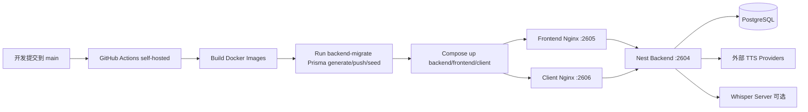

# Echoon 技术架构文档（基于当前仓库）

本文基于 `echoon` 仓库当前代码与配置整理，覆盖：

- 后端架构与 `pnpm` 多项目（Monorepo）模式
- 数据库与 Prisma
- GitHub Actions（CI/CD）
- Docker / Docker Compose
- Nginx
- 以及相关运行与部署链路

---

## 1. 总体架构概览

Echoon 采用「Monorepo + 多运行时」架构：

- **Node.js / TypeScript 主干**
  - `apps/backend`: NestJS API 服务（认证、业务模块、TTS、文档库、实时通信）
  - `apps/frontend`: React + Vite 管理端
  - `apps/client`: React + Vite 客户端
- **可选语音时间戳推理服务**
  - `infra/whisper`: whisper.cpp 的 `whisper-server`（可独立部署）

核心业务流：

1. 前端/客户端通过 HTTP 调 `backend`
2. `backend` 通过 Prisma 访问 PostgreSQL
3. TTS 场景调用外部语音厂商（MiniMax、Cartesia、Hume、ElevenLabs、Deepgram）
4. 当 TTS 无词级时间戳时，可选调用 `whisper-server` 补齐

---

## 2. pnpm 多项目模式（Monorepo）

### 2.1 目录与工作区

- 根 `package.json` 声明：
  - `workspaces`: `apps/frontend`、`apps/backend`、`apps/client`
  - `packageManager`: `pnpm@10.0.0`
- `pnpm-workspace.yaml` 也显式声明这三个包

这是一种标准的 `pnpm workspace` 单仓多包模式，收益：

- 依赖统一管理，锁文件统一（`pnpm-lock.yaml`）
- 跨项目复用同一套安装缓存和 node_modules store
- `--filter` 支持按子项目精确执行脚本（构建/迁移/启动）

### 2.2 子应用职责

- `echoon-backend`（NestJS）
  - 面向业务 API、认证、WebSocket、资料库/TTS
- `echoon-frontend`（Vite + React）
  - 管理端界面与业务操作
- `echoon-client`（Vite + React）
  - 客户端界面（偏用户侧）

### 2.3 后端模块化架构（NestJS）

`AppModule` 聚合多个业务模块，例如：

- `AuthModule`、`UserModule`
- `ConversationModule`
- `DocumentLibraryModule`（文档与 TTS）
- `StudySetModule`
- `RealtimeModule`
- `MembershipModule`、`NotificationModule`、`TicketModule`

启动入口 `main.ts` 中统一配置：

- CORS（区分生产与开发）
- 全局校验 `ValidationPipe`
- 全局响应拦截器 `SuccessResponseInterceptor`
- 全局异常过滤器 `HttpExceptionFilter`
- Socket.IO 适配器与跨域策略

---

## 3. 数据库与 Prisma

### 3.1 数据库选型与连接

- Prisma `datasource` 使用 **PostgreSQL**
- 连接串来自 `DATABASE_URL`
- 根 `docker-compose.yml` 默认推荐连接外部 PostgreSQL
  - 内置 `postgres` 服务仅在 `docker-infra` profile 下启用（备用）

### 3.2 Schema 组织与模型

`apps/backend/prisma/schema.prisma` 包含：

- 认证与用户域：`User`、`Session`、`Account`、`Verification`、`RefreshToken`
- 权限域：`Role`、`Permission`、`RoleAssignment`、`Scope`
- 会话与内容域：`Conversation`、`Message`、`Attachment`、`File`
- 文档与音频域：`DocumentLibrary`、`Tag`、`DocumentLibraryTag`
  - 包含 `AudioStatus`、`AudioProvider` 枚举
  - 支持 `audioProvider/audioModel/audioVoiceId/wordTimestamps/audioPath`
- 学习域：`StudySet`、`StudyCard`、`StudyCardProgress`
- 业务辅助域：`Membership`、`Notification`、`Ticket`

### 3.3 Prisma 工程实践

后端 `package.json` 脚本：

- `prisma:generate`
- `prisma:migrate` / `prisma:deploy`
- `prisma:push`
- `prisma:seed`
- `prisma:reset`

`seed.ts` 特点：

- 可重复执行（先按依赖顺序清表）
- 初始化权限树、管理员角色、管理员账号等基线数据
- 对表缺失（如 P2021）给出明确提示，指导先 `db push` 或 `migrate deploy`

### 3.4 Prisma 在 Nest 中接入

- `PrismaModule` 提供 `forRoot` 动态模块
- `PrismaService` 继承 `PrismaClient`
  - `onModuleInit` 建连
  - `onModuleDestroy` 断连
  - 打开 query/info/warn/error 日志

---

## 4. GitHub Actions（CI/CD）

当前仓库主要工作流：`.github/workflows/docker-compose-ci.yml`

### 4.1 触发策略

- 触发条件：`push` 到 `main`
- Runner：`self-hosted`

### 4.2 流程步骤

1. `actions/checkout@v4` 拉代码
2. `docker compose build` 构建 `backend/backend-migrate/frontend/client`
3. 校验关键变量（如 `DATABASE_URL`）
4. 运行 `backend-migrate` 容器执行 Prisma generate/push/seed
5. `docker compose up -d` 拉起 backend + frontend + client
6. 输出 `docker compose ps` 便于确认部署结果

### 4.3 Secrets / 环境变量治理

工作流通过 GitHub Secrets 注入：

- 数据库与认证：`DATABASE_URL`、`JWT_SECRET`、`BETTER_AUTH_*`
- 前端构建：`VITE_SERVER_URL`、`VITE_AUTH_BASE_URL`
- 跨域：`FRONTEND_ORIGINS`
- 语音厂商密钥：`MINIMAX/CARTESIA/ELEVENLABS/DEEPGRAM/HUME/...`
- Whisper 相关：`WHISPER_INFERENCE_URL` 等

这保证了“代码不可见密钥”的基本安全边界。

---

## 5. Docker 与 Docker Compose

### 5.1 镜像构建策略

三个 Node 应用 Dockerfile 都是多阶段构建：

- **构建阶段**：`node:22-alpine` + `pnpm` 安装依赖 + 构建产物
- **运行阶段**：
  - backend 继续基于 `node:22-alpine` 运行 `dist`
  - frontend/client 使用 `nginx:alpine` 托管静态文件

关键点：

- 基于 workspace root 拷贝 `package.json/pnpm-lock.yaml/pnpm-workspace.yaml`
- 使用 `pnpm --filter` 精准安装与构建目标应用
- backend 镜像在构建时执行 `prisma:generate`

### 5.2 根 Compose 编排（主业务栈）

`docker-compose.yml` 服务包括：

- `backend-migrate`：一次性迁移/seed 任务容器
- `backend`：Nest API
- `frontend`：管理端（Nginx 静态托管）
- `client`：客户端（Nginx 静态托管）
- `postgres`（可选，profile `docker-infra`）

端口默认映射（可由 `.env` 覆盖）：

- backend `2604 -> 3000`
- frontend `2605 -> 80`
- client `2606 -> 80`

### 5.3 数据库策略

当前默认生产思路是：

- **优先使用外部 PostgreSQL**
- Compose 内置 Postgres 仅作本地/CI 兜底

这个策略更贴近真实生产（数据库托管独立于应用容器生命周期）。

### 5.4 其他 Compose

- `apps/pipecat/docker-compose.yml`
  - Python 服务，端口 `7860`
- `infra/whisper/docker-compose.yml`
  - whisper.cpp 推理服务，默认宿主机 `2610`

---

## 6. Nginx 架构与职责

### 6.1 应用内 Nginx（frontend/client）

`apps/frontend/nginx.conf` 与 `apps/client/nginx.conf` 用于 SPA 托管：

- `root /usr/share/nginx/html`
- `try_files $uri $uri/ /index.html` 处理前端路由回退

frontend 的配置更完整，额外处理：

- `/assets/*` 强缓存（immutable）
- 兼容重写（如 `/main/assets/*`、多级路径下 assets）
- `index.html` 禁强缓存，避免版本漂移

### 6.2 与边缘网关的关系

仓库中的 Nginx 主要是**应用容器内静态托管层**。  
若生产还需要统一域名、HTTPS、限流、WAF、统一反向代理，通常会在其外层再部署一层网关（可为 Nginx/Traefik/API Gateway），这部分不在本仓库内。

---

## 7. 配置与环境变量体系

`.env.example` 给出了一套完整配置基线：

- 基础连接：`DATABASE_URL`、`REDIS_URL`、`JWT_SECRET`
- 跨域与认证：`FRONTEND_ORIGINS`、`BETTER_AUTH_URL`、`BETTER_AUTH_SECRET`
- 前端构建注入：`VITE_SERVER_URL` 等
- 端口映射：`BACKEND_HOST_PORT`、`FRONTEND_HOST_PORT`、`CLIENT_HOST_PORT`
- Whisper 可选配置：`WHISPER_INFERENCE_URL`、`WHISPER_LANGUAGE` 等

其中 `REDIS_URL` 在注释中明确为预留项（代码尚未完全接入时不会生效）。

---

## 8. 关键部署链路（推荐理解）

---

## 9. 架构特征总结

- **单仓多应用**：`pnpm workspace` 管理前后端与客户端，协作成本低
- **后端模块化**：NestJS 模块边界清晰，便于扩展业务域
- **数据库工程化**：Prisma schema + migrate/push/seed 闭环完整
- **容器化部署统一**：Dockerfile 多阶段 + Compose 一键编排
- **CI/CD 实用导向**：main 分支自动构建与部署，依赖 Secrets 注入
- **语音能力可插拔**：TTS 多厂商 + Whisper 补齐词级时间戳

---

## 10. 建议后续可补充章节（可选）

如果你后续要把这个文档升级成“正式架构说明书”，建议再补：

- 架构决策记录（ADR）：为何选外部 Postgres、为何 `db push` 与 `migrate` 并存
- 可观测性：日志归集、指标、告警（目前仓库内未形成完整章节）
- 高可用方案：多实例、健康检查、零停机发布
- 安全基线：Secrets 轮换、最小权限、网络隔离、Whisper 暴露策略
- 容量与性能基线：并发、RT、成本模型
